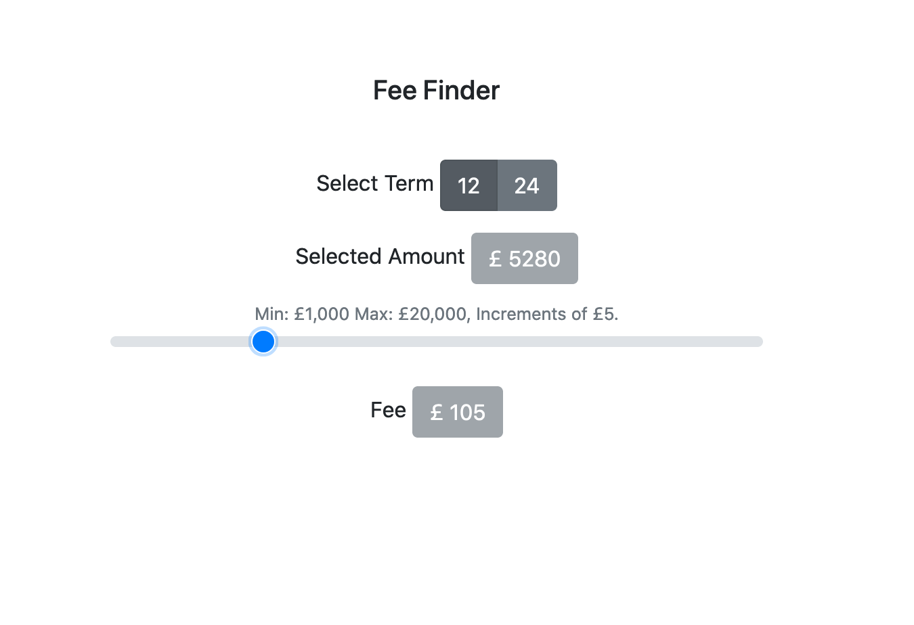

prerequisites for installing:
- virtualenv
- python3.7


install steps:
```
git clone https://github.com/NULL-OPERATOR/feefinder.git
cd feefinder
virtualenv env
source env/bin/activate
pip install -r requirements.txt
```

to run the app
```
python run.py

open https://127.0.0.1:5000
```

to run tests
```
python tests.py
```
